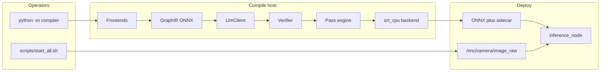
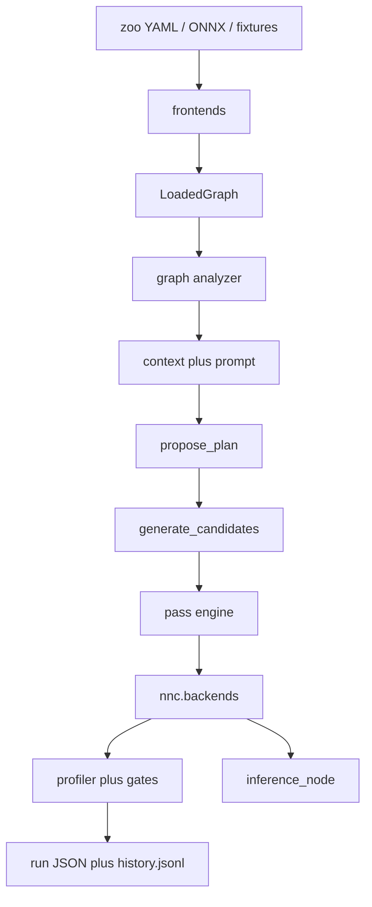
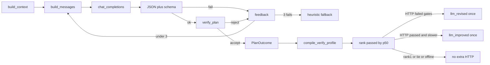

# High-level design (HLD)

**Document:** system architecture for LLM-Neural-Compiler  
**Audience:** you (Pranjal) and your mentor  
**Status:** matches `compiler/` + `src/nnc` + SITL on branch `llm-advisor`  
**Companion:** [`design.md`](design.md) (LLD — types, algorithms, schemas, CLI flags)  
**Numbers:** never in this file. Quote [`experiments/results/report.md`](../experiments/results/report.md) and [`paper_proposal.md`](paper_proposal.md).

If this document and the code disagree, the **code wins**. Fix this file.

---

## How to read this

This HLD answers: *what is the system, why is it shaped this way, what may we claim, what must we not claim.*

Read it top to bottom once. Then use the LLD when you need a field name, a sequence, or a test.

| If the mentor asks… | Section |
| --- | --- |
| What is the thesis contribution? | 1–2 |
| Why not let the LLM rewrite ONNX freely? | 3, 6, 10 |
| How does compile actually run? | 7–9 |
| Why YOLO fusion looks like a no-op? | 11 |
| Where does the drone / Gazebo fit? | 12–13 |
| What is frozen until hardware exists? | 19, 22 |
| How do I add a model / LLM host / pass? | 16 |

### 15-minute walkthrough for your mentor

Do this in order. Do not improvise FPS.

1. **Claim (2 min).** This HLD sections 1–2. The LLM names an allowlisted
   plan; the engine rewrites ONNX; a profiler measures; ROS only deploys.
   The LLM never flies.
2. **Proof the engine is real (3 min).**
   `python -m compiler emit-fixture` then `analyze fixtures/tiny_cnn.onnx`.
   Flatten width 64 / `conv_relu`. `graph_fuse` must drop Relu and keep
   `FusedConv` (unit tests lock this).
3. **YOLO honesty (3 min).** Open `experiments/results/report.md`. Fusion
   does not shrink Ultralytics DAGs (SiLU). INT8 may win **or** fail gates.
   Empty `llm_rank` means faster-but-illegal numerics, not a silent skip.
4. **Correction loop (2 min).** HLD section 8 / LLD section 4: three
   schema/verifier attempts, then heuristic `fallback_reason`. A Groq 429
   is recorded as `LLM HTTP 429 (rate_limit_exceeded)`.
5. **Deploy box (3 min).** HLD section 12: airframe `nnc_x500_cam`, topic
   `/nnc/camera/image_raw`. TensorRT / mAP / power stay frozen
   ([`deploy.md`](deploy.md)).
6. **If asked how to swap Groq.** LLD section 11: `NNC_LLM=custom` or
   `register_provider`. No second HTTP client.

Five minutes only: sections 1, 2, 11, then `report.md`.

Other docs (do not duplicate their numbers here):

| File | Job |
| --- | --- |
| [`design.md`](design.md) | LLD |
| [`paper_proposal.md`](paper_proposal.md) | claim + measured table |
| [`simulation.md`](simulation.md) | PX4 / Gazebo camera path |
| [`deploy.md`](deploy.md) | later board; TensorRT freeze |
| [`api.md`](api.md) | CLI cheat sheet |
| [`setup.md`](setup.md) | install |
| [`roadmap.md`](roadmap.md) | done vs frozen |

---

## 1. One-paragraph pitch

A PX4 companion computer must run a vision network in real time. Today a human picks a compile recipe (ORT graph opts, INT8, later TensorRT). An unconstrained language model will invent passes and invent FPS. **This system lets an LLM only name an allowlisted plan** (ordered graph-pass atoms plus ORT session options). A verifier drops what the graph or CPU cannot run. A transformation engine rewrites the ONNX DAG. A profiler **measures** compile time, p50, RSS, and numerics against the native graph. ROS 2 / PX4 / Gazebo is the **deployment box** for the same artifact, not the science.

Working title: **LLM-Guided Neural Network Compilation for Real-time UAV Edge Inference.**

---

## 2. What is the contribution, and what is not

### Contribution (compiler)

ONNX is treated as **GraphIR**: a DAG of operators and tensors, not “a YOLO file”. The pipeline is:

**frontend → GraphIR → graph summary + hardware → schema-bound plan → verifier → pass engine → backend → measured run record.**

That loop is the thesis. It is the same for the tiny CNN fixture and for YOLOv8n. The CLI never switches on the string `yolov8`.

### Not the contribution

- A new detector, a new backbone, or a COCO mAP paper.
- An LLM that flies the drone, sends setpoints, or talks to PX4 offboard.
- TensorRT latency, board power, or labelled-camera accuracy on this QEMU VM (no NVIDIA).
- A fused CPU SiLU kernel. Ultralytics YOLO ONNX uses SiLU (`Conv → Sigmoid → Mul`). ORT CPU has `com.microsoft.FusedConv` for **Conv-ReLU**, not SiLU. INT8 + thread caps are the CPU levers.

Empty `llm_uav_core` planning / control packages stay empty on purpose.

### Two planes

```
  COMPILE PLANE                          DEPLOY PLANE
  python -m compiler                     scripts/start_all.sh
  analyze / plan / optimize / matrix     Gazebo + PX4 SITL + ROS
         |                                        |
         v                                        v
  rewritten ONNX + sidecar.json  ---->  inference_node
                                        /nnc/camera/image_raw
```

Today both planes run on the **same** aarch64 QEMU VM. Later, only the camera publisher changes (`v4l2` remapped onto the same topic). See [`deploy.md`](deploy.md).

---

## 3. Problem and constraints

### Operational problem

Small drones split brains: Pixhawk / PX4 flies; a Linux companion (Jetson, Pi class) runs the camera net. People compile that net by folklore. Recipes that win on an x86 GPU box often lose on a 4-core ARM CPU. INT8 can be faster **and** fail numerics. Fusion that needs Relu does nothing on SiLU YOLO.

### LLM problem

If you ask a chat model “optimize this ONNX for the drone”, it will:

- name passes that do not exist (`fuse_conv_silu` with no kernel);
- quote FPS it never measured;
- sometimes propose flight actions.

That is unsafe and it is not a measurement. So the LLM is a **planner**, not an engine and not a pilot.

### Host constraints (this lab VM)

- `uname -m = aarch64`, QEMU, Virtio GPU, **no NVIDIA**.
- ONNX Runtime `CPUExecutionProvider` only.
- Gazebo camera works with **ogre** + Xvfb + llvmpipe. ogre2/EGL segfaults. That is an environment fact, not a compiler bug.
- Absolute p50 moves with QEMU load. Never mix two matrix runs as if they were one experiment. Never compare this p50 to a Jetson.

### Product constraints (what “production-grade” means here)

This is a **CLI on a lab VM**, not a multi-tenant SaaS. Production-grade means:

typed module boundaries, an allowlist, skip-with-reason instead of fake success, numeric gates, secret hygiene, tests that pin `NNC_LLM=heuristic`, and documents that match the code.

It does **not** mean Kubernetes, HA, or signed artifacts. If a board deploy later needs signing, that is a new requirement in [`deploy.md`](deploy.md).

---

## 4. Actors

| Actor | Runs | Needs |
| --- | --- | --- |
| Compiler / thesis operator | `python -m compiler analyze\|plan\|optimize\|matrix\|report` | `.venv`, zoo ONNX (gitignored), optional `~/.config/nnc/llm.env` |
| SITL operator | `scripts/start_all.sh`, `record_frames.py`, `sim_matrix.sh` | PX4, Gazebo Harmonic, ROS 2 Jazzy, `nnc_x500_cam` |
| CI | ruff + pytest | no API keys; `NNC_LLM=heuristic` |
| Later board operator | same `inference_node` + artifact | camera remapped to `/nnc/camera/image_raw` |

The LLM vendor (Groq or any OpenAI-compatible host) is **not** an actor inside the UAV. It only answers `chat/completions` during `plan` / `optimize`.

---

## 5. Principles (and why each exists)

1. **Allowlist, not free-form rewrite.**  
   Plans are JSON matching `schemas/llm-plan.schema.json`: at most 8 pass atoms from a closed enum, plus `ort_graph_opt` / `intra_op_threads` / `execution_mode`. Unknown atom → reject. This is how we stay honest in a paper: the search space is enumerable.

2. **Verifier is the last word.**  
   The LLM may name `fuse_bn_into_conv` on a YOLO graph that has no Conv-BN pair. The verifier **drops** that atom (`level=drop`) instead of crashing. Illegal JSON or unknown atoms are `level=reject` (`accepted=false`). The engine never sees rejected plans.

3. **Measure, do not invent.**  
   Every run JSON has `fps_claimed: false`. Missing TensorRT, missing frontend, missing calib → skip JSON with a reason string. Vendor HTTP bodies are stripped (they have contained org ids). Keys never enter git.

4. **One IR today, seams for more.**  
   GraphIR is ONNX `ModelProto`. `.pt` is a frontend (export, then compile). `.engine` is a backend output, not a source. TensorRT `compile()` still raises skip even if NVIDIA appeared — the builder is unwired.

5. **Dependency rule.**  
   `src/nnc` must not import `compiler`. ROS inference loads artifacts through `nnc.artifact`. The compiler may call backends. That split is what lets the drone node stay small.

6. **Provider-agnostic LLM.**  
   `optimize_model` depends on the `LlmClient` protocol. Groq is one `ProviderSpec` row. Adding OpenAI / Ollama / a campus vLLM is env or `register_provider`, not a second HTTP stack.

7. **The LLM row is never dropped.**  
   If the HTTP LLM emits the same `{steps, options}` as a preset, `origin=llm` stays with `same_as` pointing at the measured row. Otherwise a paper cannot talk about “what the LLM said”.

8. **Heuristic plan_id must match atoms.**  
   If the heuristic injects INT8, `plan_id` is `uav_int8_threads`, not `graph_fuse`. Lying names made an earlier table unreadable.

---

## 6. System context



External systems:

| System | Direction | Contract |
| --- | --- | --- |
| Ultralytics / torchvision / MiDaS export | in | zoo YAML + export scripts; failure → skip JSON |
| OpenAI-compatible HTTP | in | plan JSON only; no metrics in the reply |
| ONNX Runtime CPU | in-process | session from rewritten bytes |
| Gazebo Harmonic | in | Image on the ROS topic via `ros_gz_bridge` |
| PX4 SITL | parallel | flight; compiler does not subscribe to setpoints |
| GitHub Actions | CI | ruff + pytest |

---

## 7. Logical architecture (layers)



| Layer | Package | Responsibility | Must not do |
| --- | --- | --- | --- |
| Catalog | `compiler/catalog`, `experiments/zoo.yaml` | Named UAV models, export commands, task | Hard-code YOLOv8 in the pipeline |
| Ingest | `compiler/frontends` | Suffix → GraphIR or skip | Crash on `.pt` |
| Analyze | `compiler/graph`, `compiler/hardware` | FLOPs, patterns, memory, CPU flags | Mutate the DAG |
| Advise | `compiler/llm` | Prompt, HTTP/heuristic/mock, correction | Execute passes; log keys |
| Plan | `compiler/planner` | Atoms, presets, verifier, candidates | Invent atoms |
| Transform | `compiler/optimization` | Copy-and-mutate `ModelProto` | Claim latency |
| Execute | `src/nnc/backends` | ORT session / TensorRT skip | Import `compiler` |
| Measure | `compiler/profiling`, `compiler/verification` | p50/RSS/CPU; compare vs native | Invent mAP |
| Record | `compiler/history`, `compiler/report`, `compiler/schema` | UUID JSON, report.md | Store vendor HTTP bodies |
| Deploy | `inference_node`, `nnc.{artifact,preprocess,postprocess,labels}` | Camera → detections | Import `compiler`; fly |

---

## 8. Compile data flow (the loop you will explain)

This is what `python -m compiler optimize <onnx> --kind yolov8n --candidates all` does.

### 8.1 Load and summarize

`load_graph` picks a frontend by suffix. `.onnx` becomes `LoadedGraph` (bytes, sha256, `ModelProto`, `ir="onnx"`). `.pt` is a **FrontendSkip** (“export to ONNX first”), not a crash.

`summarize_graph` → `GraphSummary`: node count, top op counts, shape-inferred FLOPs, pattern counts (`conv_relu`, `conv_silu`, `conv_bn`, …), static memory, notes. Notes are human hints, for example “no fused CPU SiLU kernel; quantization/threads are the levers” when `conv_silu > 0`.

`probe_hardware` reads `/proc/cpuinfo` (features such as `asimddp`), RAM, ORT version, and NVIDIA probe. `fp16_execution` is false on `ort_cpu`.

### 8.2 Ask for a plan (bounded)

`build_context` is the **only** factual JSON the model is allowed to see: graph slice, hardware dict, allowlisted atoms with requires, last 5 history rows (`plan_id`, `p50_ms`, `passed`).

`build_messages` adds a fixed system string (“do not invent FPS”) plus applicable/skip atom lists and the JSON schema itself.

`propose_plan` calls `LlmClient.propose` up to **three** times:

| Attempt result | What happens |
| --- | --- |
| Transport error (timeout, 429, 5xx) | `PlanAttempt.outcome=transport_error`; retry; HTTP 4xx other than 408/429 is not retried inside `chat_completions` |
| JSON / schema fail | `schema_error`; feedback lists the error |
| Verifier reject | `rejected`; feedback lists reasons |
| Verifier accept | `PlanOutcome` with possibly **dropped** atoms recorded as corrections |

After three failures: `HeuristicLlmClient`, `source=heuristic`, `fallback_reason` = last error (status + short vendor `code` only).

Separately, `chat_completions` retries 408/429/5xx/`URLError` with backoff 1 s / 2 s / 4 s.

### 8.3 Candidates

`generate_candidates` always produces:

1. Presets (`baseline`, `ort_default`, `graph_fuse` in default mode; **all** presets if `--candidates all`).
2. Heuristic (always kept).
3. LLM row (always kept).

Dedup key is `json.dumps({steps, options})`. Duplicate latency is copied; `measured=false`; `same_as` names the origin that was actually profiled.

### 8.4 Verify, rewrite, compile, gate, profile

For each unique plan, `compile_verify_profile`:

1. `verify_plan` again (clamps threads to `min(4, cpu_count)`; drops `parallel` → `sequential` on `ort_cpu`).
2. `apply_plan_on_graph` runs remaining **pass** atoms in order. Options are **not** graph passes; they become `BackendOptions` on the ORT session.
3. Writes `experiments/artifacts/<kind>/<plan_id>.onnx` plus a sidecar JSON (`plan`, `options`, `sha256`).
4. Compiles rewritten bytes with plan options; compiles **native** bytes with `graph_opt=disable`.
5. Runs native vs rewritten on the same feeds. `evaluate_gates` (exact max-abs, or cosine + task agreement for INT8).
6. `profile_session`: warmup then N timed infers; RSS/CPU sampler thread.
7. `schema_version: 2` run JSON under `experiments/results/runs/<uuid>.json` + one `history.jsonl` line.

### 8.5 Rank and optional HTTP follow-up

Passed rows with a p50 are sorted ascending. `chosen` is the first **after**
any follow-up compile.

HTTP clients (`outcome.source` not heuristic/mock — Groq, OpenAI, custom, …)
get **one** extra `propose_plan` (`max_attempts=1`). Feedback includes a compact
measured table (origin, plan_id, atoms, options, p50, passed, gate error):

- compile or gates failed → `outcome=measured_failure`, origin `llm_revised`;
- passed **and** first-plan p50 is **strictly greater** than the current winner
  → `outcome=measured_not_best`, origin `llm_improved`;
- already fastest among passed rows, or tied p50 → skip (no extra HTTP).

Never both revised and improved in one run. Heuristic/mock skip this HTTP
round. Follow-up that falls back offline (`source` heuristic/mock) is recorded
as `{skipped: "fallback: …"}` and is **not** compiled. Same `json_key` →
`{skipped: "same as existing candidate", same_as: origin}`.

Write `optimize_<kind>.json` with `llm`, `llm.revised`, `llm.improved`,
`llm_rank`, `heuristic_rank`, `llm_vs_oracle_gap_pct`, `fps_claimed: false`.

`llm_rank` and `llm_vs_oracle_gap_pct` are the **first** `origin=llm` row on
the ranking **after** any follow-up. `chosen` may be `llm_improved`. A faster
INT8 plan that fails cosine is **not** chosen and has empty rank. That is a
feature: latency without numerics is not a win.



---

## 9. What a “plan” is

A plan is **not** a paragraph. It is this JSON (required keys; `additionalProperties: false`):

```json
{
  "plan_id": "uav_dynamic_quant",
  "steps": [
    {"atom": "onnx_shape_infer", "params": {}},
    {"atom": "quantize_dynamic_int8", "params": {"per_channel": true, "weight_type": "qint8"}}
  ],
  "options": {
    "ort_graph_opt": "extended",
    "intra_op_threads": 4,
    "execution_mode": "sequential"
  },
  "rationale": "High-FLOP CPU detector; INT8 weights; no SiLU fuse kernel.",
  "expected_effects": ["smaller_model", "lower_latency", "lower_memory"],
  "confidence": 0.7,
  "source": "groq"
}
```

**Pass atoms** rewrite the DAG. **Option atoms** only change the ORT session. Mixing them in `steps` as pass names is rejected (`ort_graph_opt` is an option, not a step).

Presets exist so `--strategy graph_fuse` still works and so the matrix has an oracle set that does not depend on the LLM.

---

## 10. Trust model for the LLM

| Layer | Stops |
| --- | --- |
| System prompt | Invented FPS language (also stripped from the reply) |
| JSON schema | Extra keys, unknown atoms, more than 8 steps |
| Verifier | Pattern/hardware mismatch; thread blow-up; parallel ORT CPU |
| Engine | Unknown pass name (`ValueError`) |
| Gates | INT8 that no longer matches native boxes / cosine |
| ROS | No setpoint publisher |

The model is **untrusted**. Heuristic is the offline baseline and the fallback. Tests never call Groq (`NNC_LLM=heuristic` in `tests/conftest.py`).

---

## 11. Why fusion often does nothing on YOLO (say this to the mentor)

Pattern detector:

- `conv_relu`: Conv whose **only** consumer is Relu → `fuse_conv_relu` emits `com.microsoft.FusedConv` (real ORT CPU op). Tiny CNN **must** drop the Relu node.
- `conv_silu`: Conv → Sigmoid(conv) and Mul(conv, sigmoid). Counted. **No pass**. Graph note tells the planner to use INT8/threads.
- `conv_bn`: Conv → BatchNormalization. Folded into Conv weights/bias.

Ultralytics nano detectors in this zoo are SiLU. `graph_fuse` on YOLOv8n keeps node count (e.g. 263→263). That is not a failed compiler; the allowlisted Relu fuse has nothing to fuse. MobileNetV3 / MiDaS **do** shrink (BN + Relu exist).

INT8 dynamic quantization **grows** node count (QuantizeLinear / DequantizeLinear) and **shrinks** weight bytes. It is `numerics=approx`. Gates use cosine ≥ 0.99 and, for detect/pose/segment, box `matched_ratio` ≥ 0.90 vs native FP32. Faster + failed gate = not chosen.

On this ARM CPU the heuristic also caps `intra_op_threads` at 4 and forces sequential execution. Parallel ORT on small QEMU often loses.

---

## 12. Deploy data flow (SITL)

The compiler does not need Gazebo. SITL exists so the **same** ONNX can later move to a real camera topic.

`scripts/start_all.sh` (HEADLESS=1 on this VM):

1. Micro XRCE-DDS agent  
2. `gz sim -s` with **ogre** (not ogre2), Xvfb `:99`, software GL  
3. PX4 SITL airframe **`nnc_x500_cam`** (not `gz_x500_mono_cam`)  
4. `ros_gz_bridge` Image + CameraInfo → `/nnc/camera/image_raw`  
5. `telemetry_node` (local position; independent of the compiler)  
6. Optional `inference_node` if `NNC_START_INFERENCE=1`

World: `sim/worlds/nnc_yard.sdf` (person + vehicle geometry; missing Fuel models are skipped, world still loads).

`inference_node` loads ORT via sidecar options if present, letterboxes, infers, decodes, publishes detections / latency / status / ok, and `/nnc/annotated` when asked. Class names from `nnc.labels`. **No compiler import.**

Camera success = a non-empty Image and `record_frames.py` writing `experiments/calib/gz_frames.npz`. `verify_sitl.py` only checks that x,y,z change (pose), not the camera.

Later board: remap `v4l2_camera` onto `/nnc/camera/image_raw`. Node unchanged.

---

## 13. External interfaces (summary)

**CLI** (`python -m compiler`): `emit-fixture`, `analyze`, `plan`, `recommend`, `optimize`, `compile`, `infer`, `matrix`, `report`, `export`, `zoo`, `baseline`, `probe`, `formats`. There is no `live` command.

**HTTP:** `POST {chat_url}` OpenAI chat schema. Presets: groq, openai, together, fireworks, openrouter, ollama, gemini, deepseek, mistral, xai. Custom: `NNC_LLM=custom` + `NNC_LLM_BASE_URL` + `NNC_LLM_MODEL`. Keys: `~/.config/nnc/llm.env` or `~/.config/nnc/<provider>.env`.

**ROS topics:**

| Topic | Type | Dir |
| --- | --- | --- |
| `/nnc/camera/image_raw` | `sensor_msgs/Image` | in |
| `/nnc/detections` | `vision_msgs/Detection2DArray` | out |
| `/nnc/annotated` | `sensor_msgs/Image` | out, optional |
| `/nnc/status` | `std_msgs/String` JSON | out |
| `/nnc/latency_ms` | `std_msgs/Float32` | out |
| `/nnc/ok` | `std_msgs/Bool` | out |

**On disk:** `schemas/llm-plan.schema.json`, `schemas/run-result.schema.json` (v1 and v2), `experiments/results/runs/<uuid>.json`, `optimize_<kind>.json`, `paper_matrix.json`, `history.jsonl`, artifacts + sidecars. Weights gitignored.

---

## 14. Zoo (why these models)

One YAML, one compile loop. Task strings drive **decode and gates**, not a YOLO-only pipeline.

| Kind | Task | UAV job on a companion |
| --- | --- | --- |
| yolov8n | detect | People / vehicles |
| yolo11n | detect | Newer Ultralytics nano (not a second YOLOv8) |
| yolov8n-pose | pose | Keypoints (SAR / follow) |
| yolov8n-seg | segment | Landing-zone / trail masks |
| ssdlite_mobilenetv3 | detect-lite | 320² SSD-MobileNet (Pi-class) |
| mobilenetv3_small | classify | Pad / gate / sign |
| midas_small | depth | Monocular depth cue |

Fixtures (tests only): tiny CNN `1×1×8×8` Flatten width 64 / Gemm K=64; tiny depth RGB→1ch. `K=16` is the known-broken ORT reject test.

---

## 15. Quality attributes

| Attribute | Mechanism |
| --- | --- |
| Safety of LLM output | Schema + allowlist + verifier; no flight topics |
| Honesty of metrics | Gates, skip JSON, `fps_claimed=false`, redacted HTTP errors |
| Repeatability | Fixture contract, zoo YAML, recorded warmup/iters, sha256 |
| Swap LLM | `ProviderSpec` / env |
| Swap backend | `register_backend` |
| Testability | Injected `LlmClient`; heuristic in CI |
| Observability | UUID runs, probe, `sitl_logs/` (gitignored), `/nnc/status` |
| Secrets | keys only under `~/.config/nnc/`; CLI `_redact` |

Recorded failures (not hidden): missing frontend/TRT/calib; bad LLM JSON; INT8 gate fail; Groq 429 fallback; ogre2 camera crash (use ogre).

---

## 16. How the system is meant to grow

| You want to… | Do this | Do not |
| --- | --- | --- |
| Add a UAV model | YAML row + export script | `if kind == "yolo"` in compile |
| Add a pass | `atoms.py` + schema enum + `ALLOWED_PASSES` + test | Silent no-op named as fusion |
| Add an LLM host | `register_provider` or `NNC_LLM=custom` | Fork `HttpLlmClient` |
| Add TensorRT builder | implement `TensorRtBackend.compile` on a board | Fake TRT JSON on this VM |
| Add IR | frontend + `register_ir_engine` | Parse `.pt` in the optimizer |

---

## 17. Tiny fixture contract (regression lock)

Input `1×1×8×8` → Conv → Relu → MaxPool → Flatten → Gemm. Flatten `4×4×4=64`. Gemm `K=64` (`transB=1`). Emitter refuses `K=16` unless `--broken`. `graph_fuse` must remove Relu; runtime still contains `FusedConv`. This is how we prove the engine is real, independent of YOLO.

---

## 18. Assumptions

- GraphIR = exported ONNX opset from zoo scripts. Dynamic batch is not a planner input.
- One `optimize` process per results dir (sequential candidates). `history.jsonl` is append-only, not locked.
- Calib frames (`gz_frames.npz` or ultralytics assets) are preferred for numerics; else random NCHW (`inputs_source` recorded).
- CI never has Groq keys.

---

## 19. Security and trust boundaries

| Boundary | Rule |
| --- | --- |
| LLM HTTP | TLS; key not in argv, logs, or JSON |
| Plan JSON | closed enum; max 8 steps |
| Engine | remaining atoms only |
| ROS | detections/overlay only |
| Git | no weights, no `gsk_`, no `org_` |
| ONNX files | treated as trusted lab inputs (not a sandbox) |

---

## 20. Observability

- Each compile: UUID file + history line.  
- Each optimize: `llm.attempts[]`, `fallback_reason`, `revised`, `improved`.  
- Host: `python -m compiler probe`.  
- SITL: `experiments/results/sitl_logs/`.  
- Live node: `/nnc/status` includes `inputs_source=gazebo_camera`, pre/infer/post/e2e ms, `fps_claimed: false`.

No log aggregator. That is enough on this VM.

---

## 21. Atul’s 10 phases vs this tree

| Phase | Intent | This repo |
| --- | --- | --- |
| 0 Deploy | Ubuntu, ROS, PX4, SITL | `scripts/`, `nnc_x500_cam` |
| 1–3 ONNX | CNN / YOLO / MobileNet | Analyzer: FLOPs, patterns, memory |
| 4 Compilers | TRT / TVM / ORT | ORT CPU + options; TRT skip |
| 5 Graph opts | Fuse, fold, DCE, INT8 | `compiler/optimization` |
| 6 LLM-guided | Summary → plan | Schema-bound HTTP / heuristic |
| 7 System | Parser → plan → transform | Section 7 |
| 8 Sim | Camera inference | `inference_node` |
| 9 Eval | Latency, RSS, numerics | `compile_verify_profile`, matrix |
| 10 Paper | Proposal | `paper_proposal.md` from `report.md` |

---

## 22. Out of scope on this host (frozen)

TensorRT latency, board power, COCO mAP, Isaac Sim, LLM flying, ogre2/EGL “fix” by inventing frames, `fuse_conv_silu` without an ORT CPU kernel.

When a board exists, write JSON under `experiments/results/<board>/` and extend [`deploy.md`](deploy.md). Do not invent board numbers here.

---

## 23. Mentor FAQ

**Q. Is the LLM compiling the network?**  
No. It names a plan. The engine rewrites ONNX. ORT runs it.

**Q. Did the LLM make YOLO 3× faster?**  
Quote `report.md`. Fusion alone does not. INT8 sometimes wins **and** sometimes fails gates. The LLM may still lose after one `llm_improved` try. Do not invent a win rate.

**Q. Why keep a heuristic if we have an HTTP model?**  
Offline tests, 429 fallback, and an oracle that does not depend on a vendor.

**Q. Why not TVM / AutoTVM?**  
Different search (schedules vs a small ONNX pass set). We did not replace TVM.

**Q. Why ROS at all?**  
Mentor path: sim first, then the same artifact on a drone camera topic. ROS is the deploy adapter.

**Q. Can we switch Groq for another campus model?**  
`NNC_LLM=custom` + URL + model + key env. Or `register_provider`. Same
`llm_improved` / `llm_revised` path; no Groq branch.

**Q. Where are the numbers?**  
`experiments/results/report.md`. This HLD has none on purpose.

---

## 24. Glossary

| Term | Meaning here |
| --- | --- |
| GraphIR | In-memory graph; ONNX `ModelProto` today |
| Atom | Allowlisted pass or session option |
| Plan | Ordered pass steps + options + rationale |
| Verifier | Drop/reject/clamp before the engine |
| Candidate | One plan row: preset, heuristic, llm, llm_revised, llm_improved |
| `same_as` | This JSON key was already measured |
| Backend | Loads bytes, infers |
| Skip-with-reason | JSON `skip` instead of fake success |
| Native | Unrewritten ONNX, ORT graph opt disable |
| Approx numerics | INT8/FP16; cosine + task agreement |
| `nnc_x500_cam` | PX4 SITL airframe with down camera |
| Companion computer | Linux board next to Pixhawk, not the STM32 |

---

## 25. Mapping HLD → LLD

| This HLD | LLD section in `design.md` |
| --- | --- |
| Layers | Module map + class diagram |
| `propose_plan` | Session types + sequence |
| `optimize_model` | Sequence + ranking keys |
| Passes | Per-atom algorithms |
| Gates | Numerics |
| Run JSON | Schema v2 field list |
| ROS | Node params + decode path |
| Tests | File → contract table |
