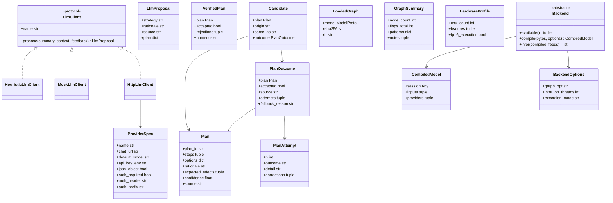
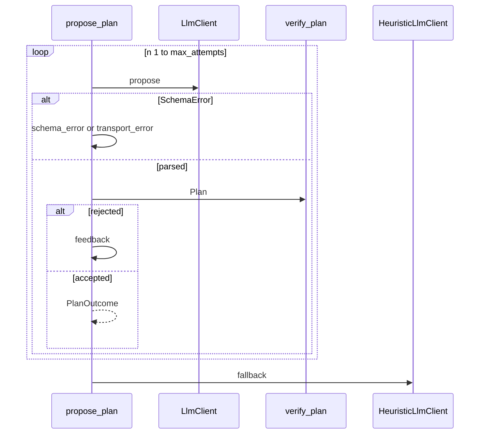
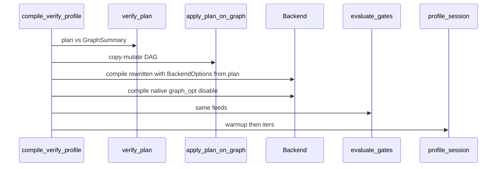
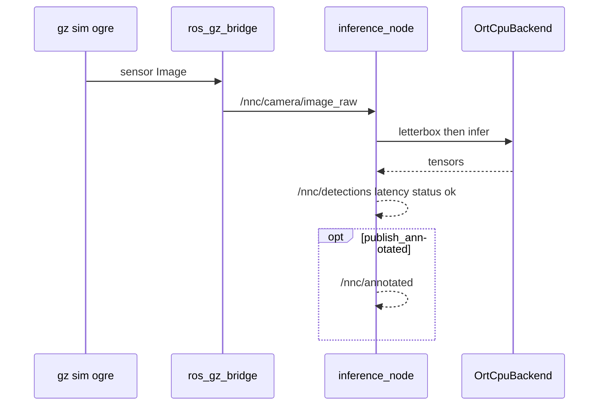

# Low-level design (LLD)

**Read after** [`architecture.md`](architecture.md). This file is the
implementation contract: types, algorithms, JSON, CLI flags, ROS params,
tests. If this file and the code disagree, **the code wins** — fix this file.

Numbers (p50, RSS, ranks) live in `experiments/results/`. `fps_claimed` is
always `false`.

| Need | Section |
| --- | --- |
| File → type | 1 |
| Classes / fields | 2 |
| `optimize_model` | 3 |
| LLM retry | 4 |
| One compile + gates | 5 |
| Heuristic if/else | 6 |
| Verifier | 7 |
| Each pass | 8 |
| Analyzer / patterns | 9 |
| Prompt payload | 10 |
| HTTP providers | 11 |
| Schema examples | 12–13 |
| Backends | 14 |
| CLI / env | 15–16 |
| ROS | 17 |
| Fixture / tests | 18–19 |
| How to extend | 21 |
| Tiny CNN vs YOLO walk-through | 22 |

---

## 1. Module map

`src/nnc` **must not** import `compiler`. Tests pin `NNC_LLM=heuristic` in
`tests/conftest.py`.

| Path | Entry |
| --- | --- |
| `compiler/cli/app.py` | `python -m compiler` |
| `compiler/catalog/zoo.py` | `ModelSpec`, `load_zoo` |
| `compiler/frontends/` | `Frontend`, suffix registry, skip map |
| `compiler/graph/graph_loader.py` | `LoadedGraph`, `load_graph` |
| `compiler/graph/graph_analyzer.py` | FLOPs, param counts |
| `compiler/graph/patterns.py` | `detect_patterns` |
| `compiler/graph/memory.py` | `activation_footprint` |
| `compiler/graph/graph_summary.py` | `GraphSummary` + notes |
| `compiler/hardware/profile.py` | `HardwareProfile` |
| `compiler/llm/context_builder.py` | `build_context` |
| `compiler/llm/prompting.py` | `SYSTEM_PROMPT`, `build_messages` |
| `compiler/llm/llm_client.py` | `LlmClient`, heuristic, mock, `build_client` |
| `compiler/llm/provider.py` | `ProviderSpec`, `HttpLlmClient` |
| `compiler/llm/session.py` | `propose_plan` |
| `compiler/llm/recommendation_engine.py` | `recommend_plan` |
| `compiler/llm/groq_client.py` | alias of `HttpLlmClient` |
| `compiler/planner/atoms.py` | `ATOMS` |
| `compiler/planner/plan.py` | `Plan`, `PRESETS` (`Strategy` alias) |
| `compiler/planner/verifier.py` | `verify_plan` |
| `compiler/planner/candidates.py` | `generate_candidates` |
| `compiler/optimization/engine.py` | `apply_plan_on_graph` |
| `compiler/optimization/optimizer.py` | `apply_plan` (per-atom timing) |
| `compiler/optimization/passes.py` | `ALLOWED_PASSES` |
| `compiler/optimization/quantize.py` | ORT INT8 wrappers |
| `compiler/data/calibration.py` | `gz_frames.npz` or ultralytics assets |
| `compiler/pipeline/compile.py` | `compile_verify_profile` |
| `compiler/pipeline/optimize.py` | `optimize_model` |
| `compiler/pipeline/matrix.py` | `run_zoo_matrix` |
| `compiler/history/store.py` | run JSON + `history.jsonl` |
| `compiler/schema/validate.py` | plan + run schemas |
| `compiler/verification/` | `compare_outputs`, `evaluate_gates` |
| `compiler/profiling/profiler.py` | p50 / RSS / CPU |
| `compiler/parsers/tiny_cnn.py` | fixture emitter |
| `src/nnc/backends/` | ORT CPU; TensorRT skip |
| `src/nnc/artifact.py` | load sidecar + infer |
| `src/nnc/{preprocess,postprocess,labels,probe}.py` | letterbox, decode, names, host |
| `ros2_ws/.../inference_node.py` | camera → detections |

---

## 2. Class diagram



`GroqLlmClient` is `HttpLlmClient(provider="groq")`. `Strategy` is an alias of
`Plan`.

### 2.1 Fields you will see in JSON

**`Plan.steps`:** `({"atom": str, "params": dict}, ...)`. Pass atoms only.
Session knobs belong in `options`, not as step atoms.

**`Plan.options`:** `ort_graph_opt` ∈ {disable, basic, extended, all};
`intra_op_threads` ≥ 1 or omitted; `execution_mode` ∈ {sequential, parallel}.

**`Plan.expected_effects`:** `fewer_nodes` | `smaller_model` | `lower_latency`
| `lower_memory` | `none`.

**`PlanAttempt.outcome`:** `schema_error` | `transport_error` | `rejected` |
`accepted`. Transport if `detail` starts with `LLM HTTP `, `LLM request failed`,
or legacy `Groq HTTP ` / `Groq request failed`.

**`VerifiedPlan.rejections[]`:** `{step, reason, level}` with
`level` ∈ {drop, reject}.

**`VerifiedPlan.numerics`:** `exact`, or `approx` if any kept pass is INT8/FP16.

**`Candidate.origin`:** `preset:<name>` | `heuristic` | `llm` | `llm_revised` |
`llm_improved`.

**`Candidate.same_as`:** origin of the first row with the same `json_key`.

**`json_key(plan)`:** `json.dumps({steps, options}, sort_keys=True)`.
`plan_id` / rationale do **not** affect dedup.

**`LoadedGraph.ir`:** `"onnx"`. `apply_plan_on_graph` dispatches
`_IR_PLAN_ENGINES[ir]`.

**`GraphSummary.patterns`:** `conv_bn`, `conv_relu`, `conv_silu`,
`conv_add_residual`, `matmul_add`, `identity_nodes`, `dropout_nodes`,
`bn_standalone`, `concat`, `resize`, `reshape_transpose_chains`,
`foldable_constant_nodes`.

**`GraphSummary.memory`:** `weights_bytes`, `activations_total_bytes`,
`peak_live_bytes`, `largest_tensor {name, bytes, shape}`.

**`GraphSummary.notes` (examples):** Flatten+Gemm K contract; no BN so BN-fuse
N/A; `conv_silu>0` → “no fused CPU SiLU kernel”; tiny param count.

**`HardwareProfile.features`:** `/proc/cpuinfo` ∩ {asimd, asimddp, fphp, bf16,
fp16, sve, i8mm}.

**`CompiledModel.inputs`:** `tuple[TensorSpec, ...]`. Do not poke the ORT
session for shapes.

---

## 3. `optimize_model`

File: `compiler/pipeline/optimize.py`.

```mermaid
sequenceDiagram
    participant Opt as optimize_model
    participant Load as load_graph
    participant Cand as generate_candidates
    participant Ses as propose_plan
    participant Comp as compile_verify_profile
    participant Disk as optimize JSON
    Opt->>Load: path
    alt FrontendSkip
        Opt->>Disk: skip fps_claimed false
    else loaded
        Opt->>Cand: summary hardware history client
        Cand->>Ses: recommend_plan
        loop each Candidate
            alt same_as already measured
                Cand-->>Opt: copy measured false
            else new key
                Opt->>Comp: plan
            end
        end
        Opt->>Opt: rank passed by p50
        alt HTTP LLM failed compile or gates
            Opt->>Ses: measured_failure max 1 plus measured table
            opt accepted HTTP and new key
                Opt->>Comp: llm_revised
            end
        else HTTP LLM passed and strictly slower
            Opt->>Ses: measured_not_best max 1 plus measured table
            opt accepted HTTP and new key
                Opt->>Comp: llm_improved
            end
        else rank 1, tie, or offline
            Opt->>Opt: skip extra HTTP
        end
        Opt->>Disk: optimize_kind.json
    end
```

**CLI:** `python -m compiler optimize MODEL --kind KIND [--task detect]
[--candidates default|all] [--warmup 5] [--iters 20] [--results DIR]`.

**`mode=default` presets:** baseline, ort_default, graph_fuse.  
**`mode=all`:** every `PRESETS` key (adds graph_simplify, graph_fuse_ort,
int8_dynamic, int8_static).

**Rank:** rows with `passed` and a p50, sorted by p50 ascending. `chosen` is
index 0 **after** any follow-up. `llm_rank` / `heuristic_rank` are 1-based in
that **final** list or `None`. `llm_rank` is the first `origin=llm` row, not
`llm_improved`.

**`llm_vs_oracle_gap_pct`:** `(first_llm_p50 - final_best_p50) / final_best_p50 * 100`.
Uses the first LLM row’s p50 **even if that row failed gates**. Negative gap + empty
rank = faster but illegal numerics. Not a win.

**`llm_revised`:** HTTP client (not heuristic/mock) and `compile_ok` is false
or `passed` is false. One `propose_plan` with `outcome=measured_failure` and a
compact measured table (origin, plan_id, atoms, options, p50, passed, gate
error). Skip compile if not accepted, if `source` is heuristic/mock
(`{skipped: "fallback: …"}`), or if `json_key` already seen
(`{skipped: "same as existing candidate", same_as: origin}`).

**`llm_improved`:** HTTP client, first plan **passed**, and its p50 is
**strictly greater** than the current winner. Tie or already fastest → no extra
HTTP (`improved` stays null). One `propose_plan` with
`outcome=measured_not_best` (chosen origin/p50, llm p50, gap, plus the same
table). Mutually exclusive with `llm_revised`. Same skip rules. Not an unbounded
search.

The `llm` row is **never omitted**. `llm.improved` / `llm.revised` record the
follow-up or `{skipped: ...}`.

---

## 4. `propose_plan`

File: `compiler/llm/session.py`. Bad replies do not raise.



Default `max_attempts=3`. Returned `Plan` is the **verified** plan (drops
applied). Drop-level corrections sit on the successful attempt’s
`corrections`. After three failures: `source=heuristic`,
`fallback_reason=last error` (HTTP status + short vendor `code`/`type` only).

---

## 5. `compile_verify_profile`

File: `compiler/pipeline/compile.py`. Writes `schema_version: 2`.



| Branch | compile.ok | skip | passed |
| --- | --- | --- | --- |
| FrontendSkip | false | frontend + reason | n/a |
| pass engine exception | false | null | false + error |
| backend unavailable | false | BackendSkip | not gated |
| ORT compile/infer throw | false | null | false |
| success | true | null | gate |

Native reference session: `BackendOptions(graph_opt="disable")`.

**Feeds:** up to 8 NCHW tensors from `load_calibration_nchw("gz_frames")` →
`inputs_source=calib`; any exception → one random tensor → `random`.

**Sidecar** next to the artifact: `plan`, `options` (`BackendOptions.to_dict()`),
`sha256`, `path`. ROS uses this so threads match the measurement.

**`steps_applied[]`:** `{atom, params, ms, nodes_before, nodes_after, op_delta}`
with only ops whose counts changed.

---

## 6. Heuristic (`HeuristicLlmClient`)

Build steps: always `onnx_shape_infer`; identity/dropout if those pattern
counts; always `constant_folding`; BN-fuse / Relu-fuse / MatMul+Add if
patterns; `quantize_dynamic_int8` if `flops_total > 1e9` **and** `asimddp`.

Then wrap:

| Condition | plan_id | Options |
| --- | --- | --- |
| `node_count <= 8` | `baseline` | empty steps; graph opt disable |
| INT8 step present | `uav_int8_threads` | extended, threads=`min(4,cpu)`, sequential |
| else Conv ≥ 1 | `graph_fuse` | same threads; **no** INT8 |
| else | `graph_simplify` | shape / identity / dropout / fold |

Never name an INT8 plan `graph_fuse`.

---

## 7. Verifier

1. `validate_llm_plan`. Fail → `accepted=false`, reject step `*`.
2. Each step: unknown/non-pass → reject whole plan; duplicate → drop;
   missing `requires` pattern → drop; missing hardware / FP16 on `ort_cpu` → drop.
3. If any structural pass kept and shape infer missing → insert shape infer first.
4. Order: shape infer, other non-quant, then quant/FP16.
5. Clamp `intra_op_threads` to `[1, min(4, cpu_count)]`.
6. Default options: graph opt disable, sequential.
7. `ort_cpu` + parallel → sequential (drop).
8. Return `accepted=true` with the **new** Plan. `numerics=approx` if any kept
   approx atom.

Structural set: identity, dropout, constant_folding, fuse_bn_into_conv,
fuse_conv_relu, fuse_matmul_add_gemm.

Verifier does **not** rename `plan_id`.

---

## 8. Pass algorithms

`apply_pass` copies the model, then runs `ALLOWED_PASSES[name]`. Unknown
name → `ValueError`.

| Atom | Algorithm |
| --- | --- |
| `onnx_shape_infer` | `onnx.shape_inference.infer_shapes`. Exception (FusedConv often cannot infer) → return copy. |
| `eliminate_identity` | Drop Identity; rewire consumers and graph IO. Also drop Dropout with `ratio==0`. |
| `eliminate_dropout` | Drop **all** Dropout nodes and rewire (inference). |
| `constant_folding` | Relu on an initializer → new initializer `max(x,0)`. Add/Mul of two initializers → fold. Skip fold if result > 64 MiB. |
| `fuse_bn_into_conv` | Conv whose only consumer is BatchNormalization. Standard fold: `W' = W * (γ/√(σ²+ε))`, `b' = (b-μ)*scale + β`. Output name becomes BN output. |
| `fuse_conv_relu` | Conv whose only consumer is Relu → `com.microsoft.FusedConv` with `activation=Relu`. Adds `com.microsoft` opset 1 if needed. Relu node removed. Tiny CNN **must** lose the Relu. |
| `fuse_matmul_add_gemm` | MatMul then Add(bias) → Gemm. |
| `quantize_dynamic_int8` | ORT `quantize_dynamic` in a temp dir. Params: `per_channel` (default true), `weight_type` qint8/quint8. |
| `quantize_static_int8` | Needs calib frames. Params: `calibration` gz_frames\|assets, `per_channel`, `format` qdq\|qoperator. Missing frames → `CalibrationUnavailable` (caller skip JSON). |
| `convert_fp16` | Cast weights; verifier drops this on `ort_cpu`. |

`prepare_for_ort` is identity (FusedConv **runs** on ORT CPU).
`expand_fused_conv` exists for debugging; the compile path does not unfuse.

Option atoms (`ort_graph_opt`, `intra_op_threads`, `execution_mode`) are
**not** in `ALLOWED_PASSES`. They become `BackendOptions`.

---

## 9. Analyzer, patterns, FLOPs, memory

**Patterns** (`detect_patterns`): walk producers/consumers.

- `conv_bn` / `conv_relu`: Conv has exactly one consumer of that type.
- `conv_silu`: Conv output feeds Sigmoid, and that Sigmoid plus the Conv feed a Mul.
- `conv_add_residual`: any Add consumer of Conv.
- `matmul_add`: MatMul then Add.
- Identity / Dropout / Concat / Resize counts.
- `foldable_constant_nodes`: Relu/Add/Mul/Identity whose inputs are all initializers/Constants.
- `reshape_transpose_chains`: Reshape followed by Transpose.
- `bn_standalone`: BN not already counted as conv_bn.

**FLOPs** (`_node_flops`): after shape inference. Conv: `2*N*Cout*Cin*Kh*Kw*H*W`
(groups handled). Gemm/MatMul: `2*batch*M*N*K`. Elementwise/pool: output numel.
Unknown shapes → that node contributes 0 with `known=false`. `flops_total` sums known.

**Memory:** weight bytes from initializers; activation peak via liveness
(tensor live from produce index to last use).

**Param count:** sum of initializer elements.

---

## 10. Context and prompt

`build_context` JSON keys: `graph` (sha256, node_count, opset, top 15 op
counts, flops_total, patterns, memory, inputs/outputs, notes, static_shapes,
origin_format, ir), `hardware` (`HardwareProfile.to_dict()`), `constraints`,
`allowlisted_atoms` (name, requires, hardware_requires, numerics), `history`
(up to 5 `{plan_id, p50_ms, passed}`).

`SYSTEM_PROMPT` (fixed): planner only; do not edit the DAG; do not invent
passes or FPS; one JSON object.

User message also includes: preset list, pass atom names, applicable vs skip
(from pattern/hardware requires), constraints JSON, history lines, the **full
plan schema**, then the context JSON. Feedback appends “Previous attempts”
with outcomes and “do not repeat rejected atoms”.

`HttpLlmClient` strips strings that look like invented FPS/ms (`_METRIC_CLAIM`)
before schema validate.

---

## 11. HTTP client and providers

`chat_completions`: POST JSON `{model, messages, temperature: 0}`. If
`json_object` and env `NNC_LLM_JSON_OBJECT` is not `0`, also
`response_format: {type: json_object}`.

Retries: status 408/429/500/502/503/504 and `URLError` that is not
`HTTPError`, backoff 1 s / 2 s / 4 s. Other 4xx: no retry.

Error string: `LLM HTTP {code}` or `LLM HTTP {code} ({short type/code})`.
**Never** the vendor body.

Auth: `Authorization: Bearer <key>` by default. Spec can change
`auth_header` / `auth_prefix` (Azure-style). Gemini may use `?key=`.
Ollama: `auth_required=False`.

Key resolution: `NNC_LLM_API_KEY`, then `os.environ[api_key_env]`, then
`~/.config/nnc/llm.env`, then `~/.config/nnc/<provider>.env`.

`NNC_LLM` / `NNC_LLM_PROVIDER`:

| Value | Client |
| --- | --- |
| heuristic | HeuristicLlmClient |
| mock | MockLlmClient |
| auto / empty | first preset with a key, else heuristic |
| named preset | HttpLlmClient(provider=name) |
| custom | `NNC_LLM_BASE_URL` + `NNC_LLM_MODEL` |

URL helper: a `/v1` base becomes `/v1/chat/completions`.

Built-in names: groq, openai, together, fireworks, openrouter, ollama, gemini,
deepseek, mistral, xai. Groq default model is whatever `ProviderSpec` says
(override with `NNC_LLM_MODEL`). Extra Groq header: browser-like User-Agent
(Cloudflare).

Reply parse: `extract_json_object` (markdown fences allowed). Then
`proposal_from_dict`: new-style `plan_id`+`steps` **or** legacy
`{strategy, rationale}` mapped onto a preset.

---

## 12. Plan schema (closed)

`schemas/llm-plan.schema.json`. Required: `plan_id`, `steps`, `options`,
`rationale`, `confidence`, `source`. `additionalProperties: false`. Max 8
steps. Step `atom` enum = pass names in §8. Options additionalProperties
false.

Example (shape only — not a measured run):

```json
{
  "plan_id": "uav_int8_threads",
  "steps": [
    {"atom": "onnx_shape_infer", "params": {}},
    {"atom": "constant_folding", "params": {}},
    {"atom": "quantize_dynamic_int8", "params": {"per_channel": true, "weight_type": "qint8"}}
  ],
  "options": {
    "ort_graph_opt": "extended",
    "intra_op_threads": 4,
    "execution_mode": "sequential"
  },
  "rationale": "High-FLOP CPU DAG; no SiLU fuse kernel.",
  "expected_effects": ["smaller_model", "lower_latency", "lower_memory"],
  "confidence": 0.7,
  "source": "heuristic"
}
```

`validate_llm_plan` enforces required keys even if `jsonschema` is not
installed.

---

## 13. Run record (schema v2) and optimize JSON

`schemas/run-result.schema.json` accepts version 1 or 2. Required:
`schema_version`, `run_id`, `created_at`, `model`, `backend`, `compile`.

**v2 extras written by `compile_verify_profile`:**

| Key | Meaning |
| --- | --- |
| `model.origin_format` / `model.ir` | ingest |
| `graph` | GraphSummary dict |
| `graph_before` / `graph_after` / `graph_runtime` | `{node_count, op_counts, sha256}` |
| `graph_changed` | node or op-count delta |
| `passes_applied` | pass names |
| `steps_applied` | per-atom timing |
| `plan` | full plan |
| `strategy` | `{strategy, rationale, source}` legacy |
| `host` / `hardware` | probe |
| `artifact` | path, sha256, sidecar, bytes |
| `compile` | ok, ms, error, providers, graph_opt, options |
| `benchmark` | warmup, iters, latency_ms {mean,p50,p95,min,max}, throughput_ips=1000/mean, fps_claimed false |
| `profile` | rss_mb, cpu_percent_mean, model_bytes, threads |
| `verification` | rejections, compare, agreement, passed, inputs_source, gate_used, numerics_kind |
| `skip` | `{backend, reason}` or null |
| `fps_claimed` | false |

Files: `experiments/results/runs/<uuid>.json` + `history.jsonl` line.
`history_for_model(kind)` returns last 5 matching kind or sha256.

### `optimize_<kind>.json`

| Key | Meaning |
| --- | --- |
| `candidates[]` | origin, plan_id, plan, p50_ms, passed, compile_ok, same_as, measured, verification, profile, artifact, node counts, run_id |
| `ranking` | origins of passed rows, p50 ascending |
| `chosen` | first of ranking or null |
| `llm` | source, attempts[], fallback_reason, same_as, rank, gap_pct, passed, p50_ms, revised, improved |
| `llm_rank` / `heuristic_rank` | 1-based or null |
| `fps_claimed` | false |

`llm.revised` / `llm.improved`: null | `{skipped, same_as?}` | `{plan_id, p50_ms, passed, rank}`.

### Numerics gates (`evaluate_gates`)

| numerics_kind | task | pass when |
| --- | --- | --- |
| exact | any | max_abs ≤ 1e-4 * max(1, \|ref_scale\|) |
| approx | detect, detect-lite, pose, segment | cosine_min ≥ 0.99 and matched_ratio ≥ 0.90 |
| approx | classify | cosine and top1_agreement ≥ 0.95 |
| approx | else (depth) | cosine only |

Detect agreement: `decode` boxes, greedy IoU ≥ 0.5. Failed gates still store
the row; ranking ignores them.

p50 is the 50th percentile of **timed** samples (warmup discarded). Index
`round(0.5 * (n-1))` on sorted ms.

---

## 14. Frontends and backends

**Frontends:** `.onnx` → `OnnxFrontend` (`check=True` runs `onnx.checker` unless
compile sets `check=False`). Skip with reason: `.pt` `.pth` (export first),
`.tflite`, `.engine` (compiled TRT, not source), `.pb`, `.xml`. Unknown suffix
→ `UnknownFrontendError`.

**`OrtCpuBackend`:** `SessionOptions` map disable/basic/extended/all to ORT
graph optimization levels; `intra_op_num_threads`; sequential vs parallel.
Provider list is **only** `CPUExecutionProvider`.

**`TensorRtBackend`:** `available()` needs nvidia-smi or `/dev/nvidia0` **and**
`import tensorrt`. `compile()` still raises
“TensorRT compile path is not wired”. Do not write fake TRT JSON.

**`get_backend(name)`** instantiates from `register_backend`. Pipeline does
not `if name == "ort_cpu"` for compile logic.

---

## 15. CLI (`python -m compiler`)

| Command | Flags that matter |
| --- | --- |
| `emit-fixture` | `--kind cnn\|depth`, `--out`, `--gemm-k`, `--broken` |
| `analyze` | MODEL → GraphSummary JSON |
| `plan` | MODEL, `--kind`, `--constraint k=v`, `--show-prompt` |
| `recommend` | MODEL, `--strategy` override, `--show-prompt` |
| `optimize` | MODEL `--kind` required, `--task`, `--candidates default\|all`, `--warmup`, `--iters`, `--results` |
| `compile` | MODEL `--backend` `--strategy` `--warmup` `--iters` `--kind` `--results` |
| `infer` | MODEL `--graph-opt` `--warmup` `--iters` (artifact load, not full compile) |
| `matrix` | `--kind`, `--candidates default\|all`, `--warmup` `--iters` `--results` `--fixture` |
| `report` | `--results` → `report.md` |
| `export` | `--kind` or all zoo |
| `zoo` | YAML dump |
| `baseline` | fixture + optional `--kind`; TensorRT skip |
| `probe` | host / PX4 / ROS / Gazebo / NVIDIA |
| `formats` | frontends, backends, llm_providers, GraphIR |

No `live` command. `matrix` without `--candidates` uses the older pair
`measure_path` (native baseline vs `recommend_strategy`). With
`--candidates default|all` it calls `optimize_model` per zoo kind (the paper
table).

Exit: 0 if at least one model measured; 2 on schema/frontend/unknown
strategy; 1 if matrix measured nothing.

CLI `_redact` refuses to print values that look like API keys.

---

## 16. Environment

| Variable | Role |
| --- | --- |
| `NNC_LLM` | heuristic \| mock \| auto \| provider \| custom |
| `NNC_LLM_PROVIDER` | same named list |
| `NNC_LLM_MODEL` | override default_model |
| `NNC_LLM_BASE_URL` | custom chat URL |
| `NNC_LLM_API_KEY` / `NNC_LLM_API_KEY_ENV` | secrets |
| `NNC_LLM_JSON_OBJECT` | `0` disables JSON mode |
| `NNC_START_INFERENCE` | start_all launches inference_node |
| `HEADLESS` | no gz client |
| `PX4_GZ_SIM_RENDER_ENGINE` | default `ogre` in `start_px4.sh` |
| `DISPLAY` | gz client / Qt GUI only |

Copy `configs/llm.env.example` → `~/.config/nnc/llm.env`. Never commit keys.

---

## 17. ROS `inference_node`

Package `llm_uav_core`. Adds `src/` to `sys.path`; **does not import
compiler**.

| Param | Default |
| --- | --- |
| `model_path` | `experiments/models/yolov8n.onnx` |
| `model_kind` | `yolov8n` |
| `task` | `detect` |
| `graph_opt` | `disable` (sidecar `options` wins) |
| `source` | `camera` (`synthetic` uses a timer) |
| `image_topic` | `/nnc/camera/image_raw` |
| `imgsz` / `conf` / `iou` | 640 / 0.25 / 0.45 |
| `publish_annotated` | false |
| `max_hz` | 10 |
| `period_sec` | 2.0 (synthetic only) |

Camera QoS: BEST_EFFORT, VOLATILE, KEEP_LAST 1. If `_busy` or under `max_hz`,
frame is dropped (`dropped_frames` in status).

Pipeline: Image → RGB (`cv_bridge` or raw rgb8/bgr8) → `letterbox` →
`infer_once` → `decode(task)` → boxes mapped with `boxes_to_original` →
`Detection2DArray`. Names from `nnc.labels.class_name`. Annotated image:
numpy rectangle borders (no OpenCV required).

`/nnc/status` JSON includes `inputs_source=gazebo_camera`,
`ms.{pre,infer,post,e2e}`, `n_det`, model sha256, `plan_id` from sidecar,
`fps_claimed: false`.



Airframe **`nnc_x500_cam`**. World `sim/worlds/nnc_yard.sdf`. Working camera
on this Virtio GPU: ogre + Xvfb `:99` + llvmpipe. See
[`simulation.md`](simulation.md).

`telemetry_node` is PX4 pose only.

---

## 18. Tiny fixture

Input `1×1×8×8` → Conv → Relu → MaxPool → Flatten → Gemm.
Flatten width 64. Gemm K=64, `transB=1`. `--broken` allows K=16 so tests can
prove ORT rejects it. `graph_fuse` must remove Relu; graph still has
`FusedConv`.

---

## 19. Tests (contract per file)

| File | Guards |
| --- | --- |
| `test_tiny_fixture.py` | Flatten 64 / Gemm K / refuse K=16 |
| `test_transformation.py` | fuse, fold, FusedConv, unknown pass |
| `test_plan_schema.py` / `test_llm_schema.py` | allowlist JSON |
| `test_heuristic_honesty.py` | INT8 not named graph_fuse; SiLU note; thread clamp |
| `test_llm_correction.py` | retry, fallback, same_as kept |
| `test_provider.py` | registry, custom URL, no vendor body |
| `test_verifier.py` | drop FP16 / missing BN / unknown atom |
| `test_pipeline_v2.py` | v2 record; INT8 does not raise |
| `test_quantize.py` | dynamic INT8; static skip or run |
| `test_backend_options.py` | threads reach ORT |
| `test_backends.py` | ORT tiny; TRT skip; K=16 fails |
| `test_labels.py` | COCO / SSD-lite / pose |
| `test_sim_assets.py` | `nnc_x500_cam`, yard person+vehicle |
| `test_matrix.py` / `test_report.py` | skip JSON + report columns |
| `test_frontends.py` | ONNX ingest; `.pt` skip |
| `test_candidates.py` | presets present |
| `test_analyzer.py` | Flatten/Gemm notes, tiny FLOPs |
| `test_numerics.py` | identical vs perturbed |
| `test_artifact.py` | load fixture |

CI: `.github/workflows/ci.yml` (ruff + pytest, heuristic). Local:
`bash scripts/run_tests.sh`.

---

## 20. Errors, secrets, processes

| Type | When |
| --- | --- |
| `CompilerError` | base |
| `FixtureError` | Flatten/Gemm contract |
| `UnknownStrategyError` | preset name not allowlisted |
| `CalibrationUnavailable` | static INT8, no frames |
| `FrontendSkip` | known suffix, no GraphIR |
| `UnknownFrontendError` | unknown suffix |
| `SchemaError` | plan / run / LLM JSON |
| `BackendSkip` | backend not on host |

Do not commit `*.env` with keys, ONNX weights, npz, `sitl_logs/`.
`git grep` `gsk_` and `org_` before push.

Compiler: one process, sequential candidates. ORT `intra_op_threads` is a
session option. SITL: MicroXRCEAgent, `gz sim -s`, px4, ros_gz_bridge,
telemetry, optional inference. `scripts/stop_all.sh` tears down.

---

## 21. How to extend (checklists)

**New zoo model:** YAML row (`kind`, `task`, `family`, `onnx`, `export_script`,
`imgsz`, `opset`, `uav_role`, `justification`, strategies in `PRESETS`); export
script that writes skip JSON on failure; same CLI. No `if kind == "yolo"` in
compile.

**New pass:** `Atom` in `atoms.py`; enum in `llm-plan.schema.json`; function +
`ALLOWED_PASSES`; unit test that the DAG actually changes; never a no-op named
as fusion.

**New LLM host:** `register_provider(ProviderSpec(...))` or `NNC_LLM=custom`.
Do not fork `HttpLlmClient`.

**New backend:** `register_backend` subclass; `available()` honest;
`compile()` must raise skip if unwired.

**New IR:** frontend + `register_ir_engine(ir, apply_fn)`.

---

## 22. Worked mental example (tiny CNN vs YOLOv8n)

**Tiny CNN.** Analyzer: few nodes, `conv_relu=1`, `conv_silu=0`, tiny FLOPs.
Heuristic: `node_count<=8` → `baseline`. `graph_fuse` preset: shape infer,
fold, `fuse_conv_relu` → Relu disappears, `FusedConv` appears. Exact numerics
(no INT8). Tests lock this. Mentor takeaway: the engine is real.

**YOLOv8n.** Analyzer: hundreds of nodes, `conv_silu>0`, `conv_relu` often 0,
FLOPs > 1e9, `asimddp` on this ARM. Heuristic: `uav_int8_threads` (INT8 +
threads≤4 + sequential + extended). `graph_fuse` preset: node count **unchanged**
because there is no Conv-ReLU pair. Dynamic INT8: nodes **up** (Q/DQ), bytes
**down**. Gates: cosine + box agreement vs native FP32. If INT8 fails, rank
empty; chosen may be `ort_default` or baseline. Groq may emit a similar INT8
plan (`uav_dynamic_quant`, …) or fall back on 429. Quote `report.md` for the
actual p50 of a given run. Mentor takeaway: allowlist + gates, not “LLM magic
FPS”.

---

## 23. Preset table

| plan_id | Steps (short) | Options |
| --- | --- | --- |
| baseline | none | graph opt disable, sequential |
| ort_default | none | graph opt all, sequential |
| graph_simplify | shape, identity, dropout, fold | disable, sequential |
| graph_fuse | shape, identity, fold, BN-fuse, Relu-fuse | disable, sequential |
| graph_fuse_ort | same DAG as graph_fuse | **extended**, sequential |
| int8_dynamic | shape, quantize_dynamic_int8 | basic, sequential |
| int8_static | shape, quantize_static_int8 (gz_frames, per_channel, qdq) | basic, sequential |

---

## 24. Catalog / matrix

`experiments/zoo.yaml` is a tiny YAML subset (list of scalar maps).
`ModelSpec.export_cmd()` = `python export_script export_args --out onnx_path`.

`run_zoo_matrix(..., candidates="all")` calls `optimize_model` per kind and
writes `paper_matrix.json` `{host, warmup, iters, backend, fps_claimed,
models: [optimize payloads]}`. `python -m compiler report` turns that into
`report.md` (plus any `sim_inference_*.json` camera rows — those are a
**different** experiment; do not mix p50s).

---

## 25. Mapping HLD → LLD

| HLD box | This file |
| --- | --- |
| Frontend | §14 |
| GraphIR | `LoadedGraph.ir` |
| Advisor | §4, §10, §11 |
| Verifier | §7 |
| Pass engine | §8 |
| Backend | §14 |
| Measure | §5, §13 |
| Deploy | §17 |
