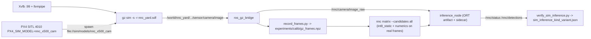

# Master plan: sim camera loop, 7-model planner matrix, hardware-ready bundle

Saved 2026-09-18 so work can resume after the host laptop shuts down.

Cursor copy: `~/.cursor/plans/sim_camera_and_7-model_master_plan_25345791.plan.md`  
Repo copy (this file): `docs/master_plan.md`  
Branch: `llm-advisor` at `93a43ed`  
Status: **not started**. Next session: execute WP1 first.

Overview: Get real Gazebo camera frames on this QEMU VM (Xvfb/llvmpipe render path, repo-owned world and drone model), run the same ROS inference path on all 7 zoo models with native vs LLM-chosen artifacts, finish the planner matrix for every kind, and package a hardware-ready bundle. Everything measured, `fps_claimed=false`, no secrets in git.

## Todos (all pending)

- **wp1-xvfb** — Install xvfb+mesa-utils; confirm llvmpipe GL 4.5 on DISPLAY=:99
- **wp1-sim-assets** — Create sim/server.config template, sim/models/nnc_mono_cam and nnc_x500_cam, sim/worlds/nnc_yard.sdf, scripts/fetch_fuel_models.sh
- **wp1-scripts** — Rework start_gz.sh (display modes, resource paths, world lookup), start_px4.sh (PX4_GZ_MODELS, stale check), start_all.sh defaults, stop_all.sh Xvfb
- **wp1-probe** — Write scripts/gz_probe_camera.sh and get sim_camera_probe.json ok:true with a 640x480 gz.msgs.Image
- **wp2-ros** — Fix inference_node shutdown crash, task-aware status/detections, camera_info bridge, start_inference.sh kind/artifact resolution, zoo JSON imgsz
- **wp2-frames** — Run stack, record gz_frames.npz (ground + hover after commander takeoff), first sim_inference_yolov8n_native.json with frames_rx>0
- **wp3-postprocess** — Task-correct decode: YOLO num_classes, pose keypoints, seg boxes, SSDLite default boxes (3234) + BoxCoder, boxes_to_original; tests/test_postprocess.py
- **wp4-optimize-all** — Run nnc matrix --candidates all --warmup 5 --iters 30 with Groq key loaded -> optimize_<kind>.json x7 + full paper_matrix.json
- **wp4-report-docs** — Extend report_generator (summary + Gazebo camera section), write docs/zoo.md replacing docs/yolov8n.md, update README models
- **wp5-sim-matrix** — scripts/sim_matrix.sh: all 7 kinds x native/chosen through camera path -> sim_inference_<kind>_<variant>.json; regenerate report
- **wp6-hardware-ready** — scripts/deploy_bundle.sh, docs/deploy.md, configs/groq.env.example, scripts/bootstrap.sh, docs/setup.md machine-switch section
- **wp7-cleanup-tests-push** — Delete zero-byte ROS stubs and empty configs, fix setup.py/package.xml, add tests/test_sim_assets.py, pytest green, rebuild ROS, commit and push without secrets

## Ground truth from inspection (do not re-investigate)

- Camera failure root cause: ogre-next headless EGL always tries EGL device #0 (`/dev/dri/card0`, virtio/virgl on an Apple host). With `LIBGL_ALWAYS_SOFTWARE=1` Mesa segfaults in `eglInitialize` ("Not allowed to force software rendering when API explicitly selects a hardware device"); without it, device 0 cannot create a GL 3.3 core context (`EGL_BAD_MATCH`). Device #1 (llvmpipe) gives GL 4.5 core. Fix = GLX through Xvfb with `LIBGL_ALWAYS_SOFTWARE=1`, no `--headless-rendering`. `xvfb` not installed; `sudo -n` works; `bwrap` blocked by AppArmor.
- PX4 standalone spawn: `px4-rc.gzsim` does `file://${PX4_GZ_MODELS}/${PX4_SIM_MODEL#*gz_}/model.sdf` and does NOT source `gz_env.sh`. So `PX4_GZ_MODELS`, `PX4_SIM_MODEL`, `PX4_GZ_WORLD` fully control model/world; the gz server resolves `model://x500`, `model://x500_base` via `GZ_SIM_RESOURCE_PATH`.
- `start_gz.sh` uses PX4 `server.config` which lists `libOpticalFlowSystem.so`/`libGstCameraSystem.so` (load errors, harmless) and ogre2 headless.
- Zoo: 7 ONNX on disk (`yolov8n`, `yolo11n`, `yolov8n-pose`, `yolov8n-seg`, `ssdlite_mobilenetv3`, `mobilenetv3_small`, `midas_small`), `matrix_<kind>.json` for all; `optimize_<kind>.json` only for `mobilenetv3_small`; `paper_matrix.json` is a one-row stub; `report_generator.py` only reads the optimize shape.
- ONNX heads: YOLO detect `[1,84,8400]`, pose `[1,56,8400]`, seg `[1,116,8400]+[1,32,160,160]`, SSDLite `bbox_regression [1,3234,4]` + `cls_logits [1,3234,91]` (raw, needs default boxes), MobileNet `[1,1000]`, MiDaS `[1,256,256]`.
- `src/nnc/postprocess.py::decode` routes detect-lite/pose/segment to the YOLO decoder (wrong for all three). `inference_node.py::main` calls `rclpy.shutdown()` after `ExternalShutdownException` (crash in `inference.log`). `sim_inference_yolov8n_baseline.json` has `frames_rx: 0` (synthetic).
- Stale files: 14 zero-byte files under `ros2_ws/src/llm_uav_core/llm_uav_core/{control,llm,planning,state,utils}/` and `nodes/{offboard,planner,logger}_node.py`; `configs/{gazebo,llm,px4,ros2}/*.yaml` all 0 bytes.

## Target loop

## WP1. Gazebo camera on this VM

Files: new `sim/` tree, edits to `scripts/start_gz.sh`, `scripts/start_px4.sh`, `scripts/start_all.sh`, `scripts/stop_all.sh`, new `scripts/gz_probe_camera.sh`, new `scripts/fetch_fuel_models.sh`.

1. `sudo apt-get install -y xvfb mesa-utils`. Confirm `DISPLAY=:99 LIBGL_ALWAYS_SOFTWARE=1 glxinfo -B` reports llvmpipe with OpenGL core 4.5 after starting `Xvfb :99 -screen 0 1280x1024x24 -nolisten tcp`.
2. `sim/server.config`: copy of PX4 `src/modules/simulation/gz_bridge/server.config` minus the two `custom::` plugins, with `<render_engine>@RENDER_ENGINE@</render_engine>`. `start_gz.sh` substitutes it with `sed` into `$LOGDIR/server.config` and exports `GZ_SIM_SERVER_CONFIG_PATH` to that file (deterministic, no reliance on CLI override).
3. `sim/models/nnc_mono_cam/{model.config,model.sdf}`: copy of PX4 `mono_cam` with `<width>640</width><height>480</height>`, `<format>R8G8B8</format>`, `<update_rate>10</update_rate>`, `<visualize>false</visualize>`. Keep `camera_link`, `camera_imu`.
4. `sim/models/nnc_x500_cam/{model.config,model.sdf}`: copy of PX4 `x500_mono_cam` with `<model name="nnc_x500_cam">`, include `model://nnc_mono_cam`, camera pose `.12 .03 .242 0 0.35 0` (20 degree down tilt) in both the include and `CameraJoint`.
5. `sim/worlds/nnc_yard.sdf`: `<world name="nnc_yard">`, physics/gravity/magnetic_field/atmosphere/spherical_coordinates/sun copied from PX4 `default.sdf`, `<shadows>false</shadows>`, ground plane with a darker diffuse (0.35 0.45 0.3). Targets in the camera's forward cone (drone spawns at origin facing +x, HFOV 1.74 rad): primitives always present (two boxes 1x1x1 at (5,-1.5,0.5) red and (7,1.5,0.5) blue, one cylinder at (4,0,0.5) yellow), PX4 offline models `model://arucotag` at (5,2.5,0.4) and `model://helipad` at (8,0,0.01); Fuel includes at `https://fuel.gazebosim.org/1.0/OpenRobotics/models/<Name>` for `Pickup` (9,-3,0, yaw 1.2), `Standing person` (6,1,0), `Construction Cone` (4,-1,0), `hatchback_blue` (12,3,0, yaw -0.6). `scripts/fetch_fuel_models.sh` pre-downloads each with `gz fuel download -u <url>`; drop any URI that 404s. Offline runs must still load (missing include = logged, world continues).
6. `scripts/start_gz.sh`: `ROOT` aware; `GZ_SIM_RESOURCE_PATH=$ROOT/sim/models:$ROOT/sim/worlds:$PX4/Tools/simulation/gz/models:$PX4/Tools/simulation/gz/worlds`; `GZ_SIM_SYSTEM_PLUGIN_PATH=$PX4/build/px4_sitl_default/src/modules/simulation/gz_plugins`; world lookup `$ROOT/sim/worlds/$WORLD.sdf` then PX4 worlds. `NNC_GZ_DISPLAY=auto|xvfb|x11|egl`: `auto` = use `$DISPLAY` if set, else start `Xvfb :99` if not already running and export `DISPLAY=:99`; `xvfb`/`x11` set `LIBGL_ALWAYS_SOFTWARE=1` and no `--headless-rendering`; `egl` keeps `--headless-rendering` and unsets `LIBGL_ALWAYS_SOFTWARE` (for real-GPU hosts). Default render engine `ogre2`, `NNC_GZ_RENDER=ogre` as the lighter fallback. Pass `-v 3` and log to `$LOGDIR/gz.log`.
7. `scripts/start_px4.sh`: export `PX4_GZ_MODELS="${PX4_GZ_MODELS:-$PX4_DIR/Tools/simulation/gz/models}"`; refuse to start if `pgrep -f build/px4_sitl_default/bin/px4` is non-empty (the `PX4 server already running` case in `px4.log`). `scripts/start_all.sh`: defaults `PX4_GZ_WORLD=nnc_yard`, `PX4_SIM_MODEL=nnc_x500_cam`, `PX4_GZ_MODELS=$ROOT/sim/models`; call `stop_all.sh` first. `scripts/stop_all.sh`: also kill `Xvfb :99`.
8. `scripts/gz_probe_camera.sh` (no PX4): start gz via `start_gz.sh`, spawn `nnc_x500_cam` with the same `gz service -s /world/nnc_yard/create ... file://$ROOT/sim/models/nnc_x500_cam/model.sdf` call PX4 uses, wait up to 60 s for a topic matching `/sensor/camera/image$`, `gz topic -e -n 1` it, write `experiments/results/sim_camera_probe.json` with `ok`, `display_mode`, `render_engine`, `topic`, `width`, `height`, `tried[]`, `gl_renderer` (from glxinfo), `fps_claimed: false`. Order to try: ogre2+xvfb, ogre+xvfb, ogre2+egl (expected fail, keep the error line). Stop the server after.

Acceptance: `sim_camera_probe.json.ok == true`, one `gz.msgs.Image` echoed with width 640 height 480.

## WP2. Camera-in-the-loop ROS path

Files: `scripts/start_camera_bridge.sh`, `ros2_ws/src/llm_uav_core/llm_uav_core/nodes/inference_node.py`, `scripts/record_frames.py`, `scripts/verify_sim_inference.py`, `scripts/start_inference.sh`.

1. `start_camera_bridge.sh`: also bridge `camera_info` to `/nnc/camera/camera_info`; keep the `/sensor/camera/image$` grep (matches the new topic).
2. `inference_node.py`: fix `main()` (catch `ExternalShutdownException`, call `rclpy.shutdown()` only if `rclpy.ok()`); camera status payload gets `inputs_source: "gazebo_camera"`, `image_topic`, `image_wh`; publish `Detection2DArray` only for box tasks, `classify` puts `top1`/`score` in status, `depth` puts `min/max/mean` in status; use `imgsz` param for every task (already there), no other logic changes.
3. `start_inference.sh`: input `NNC_MODEL_KIND` (default `yolov8n`) and `NNC_ARTIFACT=native|chosen`; resolve `task`, `imgsz`, native ONNX from `.venv/bin/python -m compiler zoo` (add `imgsz` to that JSON row in `compiler/cli/app.py::cmd_zoo`), and the chosen artifact from `experiments/results/optimize_<kind>.json` `chosen.artifact.path` (fail with a clear message if absent).
4. Run: `scripts/start_all.sh`, then `python3 scripts/record_frames.py --n 64 --every 2 --world nnc_yard --airframe nnc_x500_cam --render ogre2` to produce `experiments/calib/gz_frames.npz` + `.json` (sha256, shape). Then `scripts/px4_cmd.sh commander takeoff`, wait 15 s, record a second set `--out experiments/calib/gz_frames_hover.npz`, `commander land`.
5. Run `NNC_START_INFERENCE=1 NNC_MODEL_KIND=yolov8n` and `python3 scripts/verify_sim_inference.py --seconds 40 --out experiments/results/sim_inference_yolov8n_native.json`. Acceptance: `frames_rx > 0`, `inferences > 0`, `e2e_ms.p50` present, `detections_total` reported as measured (0 is allowed, never faked).

## WP3. Task-correct postprocess (the 7-model surface)

Files: `src/nnc/postprocess.py`, new `tests/test_postprocess.py`.

1. `yolo_decode_nms(raw, *, num_classes, conf, iou)`: rows `[0:4]` xywh, class scores `[4:4+num_classes]`; remove the dead shape heuristics. `detect` → `num_classes = rows-4`; `pose` → `num_classes=1` and return `keypoints [N,17,3]` from rows `5:56`; `segment` → `num_classes=80` (rows 84:116 mask coefficients ignored, say so in a comment and in the status `mask_decoded: false`).
2. `ssdlite_decode(bbox_regression, cls_logits, *, conf, iou)`: numpy default boxes equal to torchvision `DefaultBoxGenerator` for SSDLite320 (feature maps 20,10,5,3,2,1; scales 0.2..0.95 plus 1.0; aspect ratios 2,3; steps 16,32,64,107,160,320) → exactly 3234 boxes; BoxCoder weights (10,10,5,5); softmax over 91, drop background 0; class-agnostic NMS (document as a simplification vs torchvision per-class NMS). Boxes returned in 320 letterbox pixels so `_publish_detections` un-letterboxing stays unchanged.
3. Move the un-letterbox math from `inference_node._publish_detections` into `nnc.postprocess.boxes_to_original(boxes, meta)` and call it from the node.
4. `tests/test_postprocess.py`: synthetic `[1,84,8400]`, `[1,56,8400]`, `[1,116,8400]` decode shapes and one hand-built positive; default box count == 3234; `boxes_to_original` round trip. Integration test (skip if ONNX missing): run `experiments/models/ssdlite_mobilenetv3.onnx` on `ultralytics/assets/bus.jpg` and assert a COCO-91 label in {1 person, 6 bus} appears with score > 0.3.

## WP4. Planner runs on every kind, one paper matrix, one report

Files: `compiler/report/report_generator.py`, `docs/zoo.md` (replaces `docs/yolov8n.md`), `README.md`.

1. Run once with the Groq key loaded from `~/.config/nnc/groq.env` (never copy it anywhere): `.venv/bin/python -m compiler matrix --candidates all --warmup 5 --iters 30`. This writes `optimize_<kind>.json` for all 7 and a full `paper_matrix.json`. `int8_static` and numerics now use `experiments/calib/gz_frames.npz` (`inputs_source: "calib"`); if WP1 failed they fall back to assets and the JSON says so.
2. `report_generator.py`: add a summary section over all rows: kind, task, baseline p50 (`preset:baseline`), chosen plan, chosen p50, speedup, passed, `llm_rank`, `llm_vs_oracle_gap_pct`, `inputs_source`; add a "Gazebo camera loop" section that lists every `experiments/results/sim_inference_*.json` (kind, variant, frames_rx, inferences, e2e p50/p95, infer p50/p95, detections_total). Keep "Not measured" block. Run `.venv/bin/python -m compiler report`.
3. `docs/zoo.md`: the 7 kinds with task, input, UAV role, export command, decode status (full / boxes-only / compile-only), and a pointer to `report.md` for numbers (no hand-typed latencies). Delete `docs/yolov8n.md`; README "Models" lists all 7 and the two new scripts.
4. Optional (only if the mentor wants an extra family): `yolov5nu` is a 10-line `zoo.yaml` addition through `export_ultralytics.py`; do not add NanoDet/YOLOX (export fragility).

## WP5. Sim matrix: every model through the camera path, native vs chosen

Files: new `scripts/sim_matrix.sh`.

1. Loop over `.venv/bin/python -m compiler zoo` kinds; for `variant in native chosen`: `NNC_MODEL_KIND=$kind NNC_ARTIFACT=$variant scripts/start_inference.sh &`, `python3 scripts/verify_sim_inference.py --seconds 40 --out experiments/results/sim_inference_${kind}_${variant}.json`, kill the node, 3 s gap. One model at a time (llvmpipe and ORT share 6 vCPUs; say so in the JSON `note`).
2. Requires the stack from WP1/WP2 up. Each JSON must have `frames_rx > 0`; if not, `ok:false` and the run is reported as such, not dropped.
3. Feed into `nnc report` (WP4 step 2). This is the sim results figure for the thesis.

## WP6. Hardware-ready before hardware exists

Files: new `docs/deploy.md`, new `scripts/deploy_bundle.sh`, new `configs/groq.env.example`, new `scripts/bootstrap.sh`, `docs/setup.md`.

1. `scripts/deploy_bundle.sh`: tar `experiments/artifacts/<kind>/<chosen>.onnx` + sidecar for every kind that has `optimize_<kind>.json`, `experiments/zoo.yaml`, `src/nnc/`, `ros2_ws/src/llm_uav_core/`, `scripts/start_inference.sh`, `scripts/start_camera_bridge.sh`, plus `MANIFEST.sha256` → `dist/nnc_bundle_<git-sha>.tar.gz` (`dist/` is gitignored). Same artifact bytes go to the drone; that is the mentor's "same model".
2. `docs/deploy.md`: companion targets (Jetson Orin Nano / RPi 5), OS packages, `pip install onnxruntime`, `nnc probe` expected output, camera node (`v4l2_camera` or `usb_cam`) remapped to `/nnc/camera/image_raw` so `inference_node` is unchanged, how `nnc compile --backend tensorrt` stops skipping on Jetson, where board results go (`--results experiments/results/<board>/`), and the explicit list still "not measured" (TensorRT latency, power, mAP).
3. `configs/groq.env.example` with `GROQ_API_KEY=` placeholder; `scripts/bootstrap.sh` (venv, `pip install -e .`, `emit-fixture`, `nnc probe`); `docs/setup.md` gets the machine-switch section (clone `llm-advisor`, bootstrap, `scp ~/.config/nnc/groq.env`, PX4/ROS are OS installs, `sim/` needs only PX4 models path).

## WP7. Cleanup, tests, push

1. Delete zero-byte files: `ros2_ws/.../{control,llm,planning,state,utils}/`, `nodes/{offboard,planner,logger}_node.py`, `configs/{gazebo,llm,px4,ros2}/`. Update `setup.py` packages/`package.xml` (drop unused `ament_*` test deps) so `scripts/build_ros.sh` still builds. Keep `configs/groq.env.example` only.
2. New tests: `tests/test_postprocess.py` (WP3); `tests/test_sim_assets.py` (parse `sim/worlds/nnc_yard.sdf` and both model SDFs with `xml.etree`: world name `nnc_yard`, camera 640x480 update_rate 10, model name `nnc_x500_cam`, server.config has the Sensors plugin and the placeholder); extend `tests/test_report.py` for the new sections and `tests/test_catalog.py` for `imgsz` in zoo JSON. `PYTEST_DISABLE_PLUGIN_AUTOLOAD=1 pytest -q` green.
3. Rebuild ROS (`scripts/build_ros.sh`), rerun `scripts/gz_probe_camera.sh` once more from a clean `stop_all.sh`, then commit on `llm-advisor` and push. Never commit `groq.env`, `*.onnx`, `*.npz`, `sitl_logs/`.

## Honesty rules for every JSON

- `fps_claimed: false` everywhere; `achieved_hz` only from counted messages over wall seconds.
- Camera JSON carries `inputs_source: "gazebo_camera"`, `render_engine`, `display_mode`, `world`, `airframe`; synthetic runs stay labeled `synthetic`.
- A failed camera probe writes `ok:false` with the exact log line. No replay publisher pretending to be a camera.
- TensorRT, board power, COCO mAP, GPU utilisation: not measured until hardware.

## Order and rough effort

WP1 (2-3 h incl. Xvfb install and probe) → WP2 (1 h) → WP3 (2 h) → WP4 (30-40 min compute + 1 h report/docs) → WP5 (20 min compute) → WP6 (1 h) → WP7 (1 h). WP3 and WP6 do not depend on the camera and can run while WP4 computes.

## Resume tomorrow

Open this file, then say execute the master plan. Start at WP1. Groq key stays in `~/.config/nnc/groq.env` (not git).
